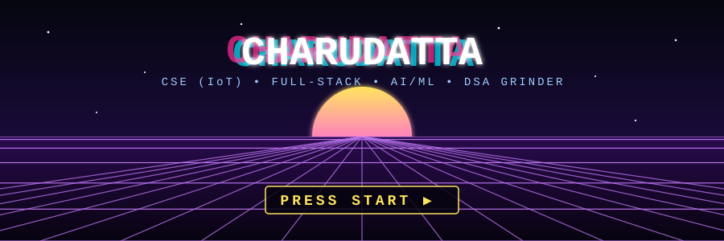

<div align="center">



<br/>


<br/><br/>

<a href="https://github.com/CharudattaLende"></a>
<a href="https://www.linkedin.com/in/charudatta-lende-812009326/"></a>
<a href="mailto:charudatta.lende.dev@gmail.com"></a>

<br/><br/>


</div>

<br/>

## 🎮 `PLAYER_ONE.sav`

<div align="center">

</div>

<br/>

```bash
$ whoami
charudatta — CSE (IoT) student, full-stack developer

$ cat now.txt
Learning by building. Sharpening Java DSA, exploring AI/ML and LLMs,
experimenting with Computer Vision + IoT, and aiming to engineer
real-world systems that actually ship.

$ echo $NEXT
software engineering opportunities • MS abroad
```

<br/>


## 🛡️ `INVENTORY` (tech stack)

<div align="center">

**⚔️ Languages**<br/>


**🎨 Frontend**<br/>


**⚙️ Backend**<br/>


**🗄️ Databases**<br/>


**🧠 AI / ML**<br/>


**🧰 Tools**<br/>


</div>

<br/>

 

## 🐍 `CONTRIBUTION SNAKE` (it eats my commits)

<div align="center">
<picture>
  <source media="(prefers-color-scheme: dark)" srcset="https://raw.githubusercontent.com/CharudattaLende/CharudattaLende/output/github-snake-dark.svg" />
  <source media="(prefers-color-scheme: light)" srcset="https://raw.githubusercontent.com/CharudattaLende/CharudattaLende/output/github-snake.svg" />
  
</picture>
</div>

<br/>

<div align="center">

```
╭────────────────────────────────────────╮
│  CODE → BUILD → BREAK → LEARN → REBUILD │
│                                        │
│        🎮  CONTINUE?  [ YES ]  ▮        │
╰────────────────────────────────────────╯
```


</div>
